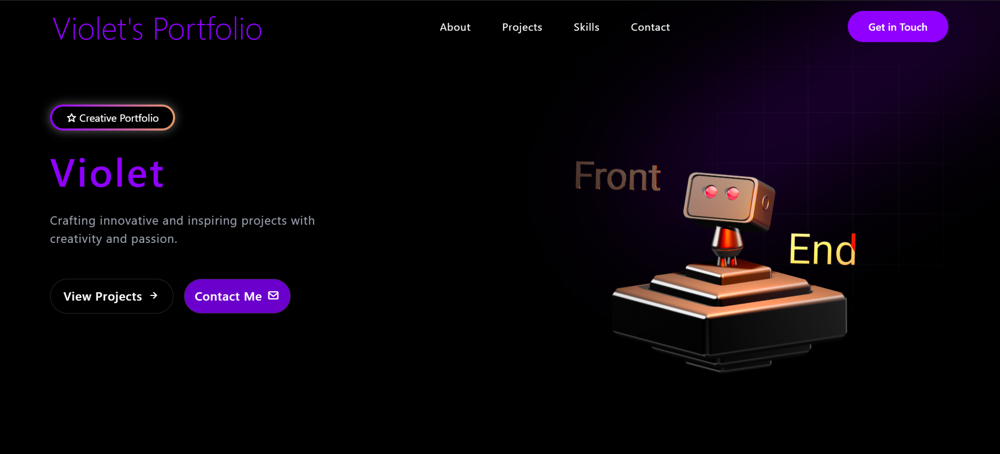

# Violet's Portfolio

## Overview
Violet's Portfolio is a modern, visually appealing single-page web application showcasing creative projects and skills. This portfolio highlights innovative design and functionality. The application features a responsive layout, smooth animations, and interactive elements to provide an engaging user experience.

## Features
- **Responsive Design**: Optimized for both desktop and mobile devices with a mobile-friendly navigation menu.
- **Dynamic Animations**: Smooth scroll-based animations, enhancing user interaction.
- **3D Visuals**: Interactive 3D robot model in the hero section.
- **Utility-first CSS Styling**: Sleek, customizable design with gradient effects and hover transitions.
- **Interactive Navigation**: Includes a desktop navigation bar and a toggleable mobile menu for seamless user navigation.
- **Creative Hero Section**: Combines a gradient background, blur effects, and a tag box with a gradient border to create a visually striking introduction.

## Technologies Used
- **React**: JavaScript library for building the user interface and managing component-based architecture.
- **Tailwind CSS**: Utility-first CSS framework for styling and responsive design.
- **JavaScript**: Core programming language for interactivity and functionality.
- **AOS (Animate on Scroll)**: Library for triggering animations on scroll events.
- **Spline**: Tool for embedding interactive 3D models in the hero section.
- **Boxicons**: Icon library for adding visually appealing icons to buttons and navigation.

## Installation
To run this project locally, follow these steps:

1. **Clone the Repository**:
   ```bash
   git clone https://github.com/your-username/violets-portfolio.git
   cd violets-portfolio
   ```

2. **Install Dependencies**:
   Ensure you have Node.js installed, then run:
   ```bash
   npm install
   ```

3. **Install Additional Libraries**:
   Install AOS, Spline, and Boxicons:
   ```bash
   npm install aos @splinetool/react-spline boxicons
   ```

4. **Run the Application**:
   Start the development server:
   ```bash
   npm run dev
   ```
   The application will be available at `http://localhost:5173` (default Vite port).

## Project Structure
```
PORTFOLIO_2/
├── node_modules/       # Node.js modules and dependencies
├── public/
│   ├── gradient.png    # Gradient image used as a decorative background element
│   ├── vite.svg        # Vite logo SVG
│   └── src.svg         # Additional SVG asset
├── src/
│   ├── assets/         # Asset directory
│   │   └── react.svg   # React logo SVG
│   ├── components/     # Component directory
│   │   ├── Header.jsx  # Header component with desktop and mobile navigation
│   │   └── Hero.jsx    # Hero section with 3D Spline model and animated text
│   ├── App.jsx         # Main application component, initializes AOS and renders header and hero
│   ├── index.css       # CSS file for custom styles
│   ├── main.jsx        # Main entry point for the React application
├── .gitignore          # Git ignore file
├── eslintrc.config.js  # ESLint configuration
├── index.html          # HTML template for Vite
├── package-lock.json   # Lock file for package versions
├── package.json        # Project metadata and dependencies
├── postcss.config.js   # PostCSS configuration
├── README.md           # Project documentation
├── tailwind.config.js  # Tailwind CSS configuration
└── vite.config.js      # Vite configuration
```

## Dependencies
- `react`: ^18.2.0
- `tailwindcss`: ^3.4.1
- `aos`: ^2.3.4
- `@splinetool/react-spline`: ^2.2.6
- `boxicons`: ^2.1.4

